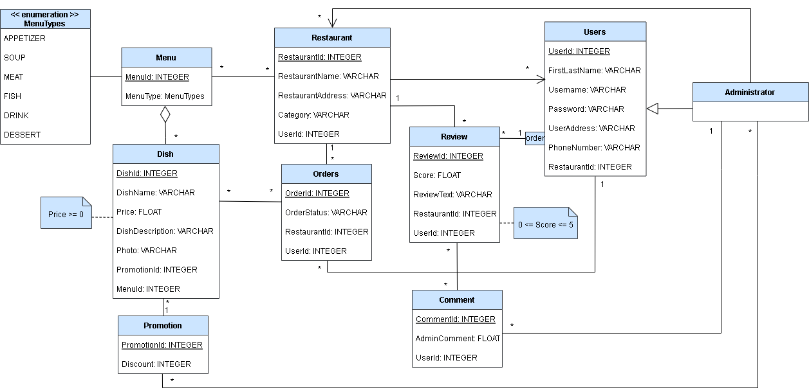

# LTW - T11 - G02

## Uml diagram

## Mockup

## Pages

* [index.php](Pages/index.php)
* [restaurant.php](Pages/restaurant.php)
* [dish.php](Pages/dish.php)
* [order.php](Pages/order.php)
* [review.php](Pages/order.php)
* [profile.php](Pages/profile.php)
* [register.php](Pages/register.php)
* [admin.php](Pages/admin.php)
* [adminoperation.php](Pages/adminoperation.php)
* [info.php](Pages/info.php)

## Templates

* [common.tpl.php](Templates/common.tpl.php)
* [restaurant.tpl.php](Templates/restaurant.tpl.php)
* [dish.tpl.php](Templates/dish.tpl.php)
* [user.tpl.php](Templates/user.tpl.php)
* [order.tpl.php](Templates/order.tpl.php)
* [review.tpl.php](Templates/review.tpl.php)
* [admin.tpl.php](Templates/admin.tpl.php)

## Classes

* [restaurant.class.php](Classes/restaurant.class.php)
* [session.class.php](Classes/session.class.php)
* [menu.class.php](Classes/menu.class.php)
* [dish.class.php](Classes/dish.class.php)
* [user.class.php](Classes/user.class.php)
* [order.class.php](Classes/order.class.php)
* [review.class.php](Classes/review.class.php)
* [admin.class.php](Classes/admin.class.php)

## Actions

* [action_edit_profile.php](Actions/action_edit_profile.php)
* [action_login.php](Actions/action_login.php)
* [action_logout.php](Actions/action_logout.php)
* [action_register.php](Actions/action_register.php)
* [action_delete_order.php](Actions/action_delete_order.php)
* [action_admin.php](Actions/action_admin.php)

## Database

* [connection.db.php](Database/common.db.php)
* [database.sql](Database/database.sql)

## API

* [restaurants.api.php](Api/restaurants.api.php)
* [saveReview.api.php](Api/saveReview.api.php)

## CSS

* [style.css](Css/style.css)

## JavaScript

* [script.js](Javascript/script.js)

## Project developed by
* [Daniela Tomás - up202004946](https://github.com/DanielaTomas)
* [Gil Andrade - up201604138](https://github.com/gilandrade10)
* [Henrique Vicente - up202005321](https://github.com/ProHacker2020)
